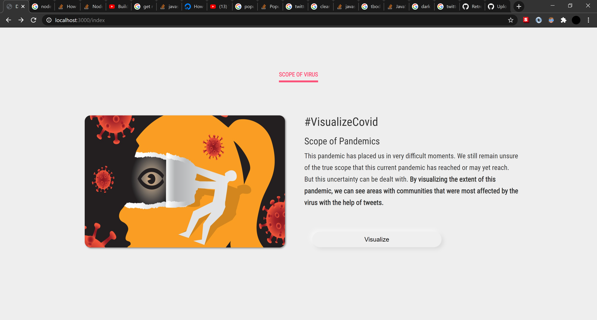

# DoomsNay
A simple website to visualize tweets being made about covid, and get good information regarding covid from tweets.
The site serves to map out locations in the United States affected by COVID, and get an understanding of how serverly a place was affected.
The site maps out these locations by counties in the U.S., and updates a table of rows of your past searchs providing you with up-to-date data of 
the number of cases and number of deaths in that U.S. county. Additionally, by using the Twitter API, the site provides recent tweets of what users are saying 
with regards to covid in that area. 

### Portrait View of Website DoomsNay
  
  
  
  
  
  
